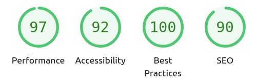

# t-sui — TypeScript Server‑Rendered UI

A tiny server-side UI toolkit in TypeScript that renders HTML strings and ships a minimal HTTP server to wire routes and actions. It provides Tailwind-friendly primitives and ready-to-use components (inputs, selects, buttons, tables), plus simple AJAX-style helpers for partial updates — no client framework required.

- Minimal, dependency‑light server (Node http) with GET/POST routing
- HTML builder API with composable components and class utilities
- Tailwind-compatible class strings out of the box
- Form helpers that serialize/deserialize values and post via `fetch`
- Partial updates (replace or inner swap) by targeting elements
- Dev autoreload via WebSocket
- Deferred fragments via WebSocket with skeleton placeholders

## Lighthouse Snapshot

The examples server (`npx tsx examples/main.ts`) scores well on Lighthouse when running locally without extra tweaking. The screenshot below shows a representative run against the showcase route:



## Quick Start

Prereqs: Node 18+ recommended (or Bun 1.0+).

- Install deps: `npm install`
- Start the examples server:
    - Option A (Node.js): `npx tsx examples/main.ts`
    - Option B (Node.js with npm script): `npm run dev`
    - Option C (Bun): `bun examples/main.ts` or `npm run dev:bun`
- Open `http://localhost:1423` and try the routes:
    - `/` Showcase
    - `/button`, `/text`, `/password`, `/number`, `/date`, `/area`, `/select`, `/checkbox`, `/radio`, `/table`, `/append`, `/others`

The examples demonstrate components, form handling, partial updates, and client helpers.

Note: Examples include a high‑contrast SVG favicon (blue rounded square with white "UI") embedded as a data URL. To change it, edit `examples/main.ts:34` and adjust colors or text in `addFavicon()`.

## Runtime Support

The `ui.server.ts` module automatically detects the runtime environment and uses the appropriate server implementation:

- **Node.js (18+)**: Uses the built-in `http` module with manual WebSocket upgrade handling.
- **Bun (1.0+)**: Uses Bun's native `serve()` API with built-in WebSocket support for better performance and simpler code.

Both runtimes support:
- WebSocket connections for real-time patches (clock updates, deferred content, etc.)
- Session management via cookies
- Form submissions and partial DOM updates
- Development features (auto-reload, hot updates)

## How It Works

There are two main modules (plus optional data helpers):

- `ui.ts`: HTML builder and components. Exports a default `ui` object with functions like `div`, `form`, `Button`, `IText`, `INumber`, `ISelect`, `SimpleTable`, etc.
- `ui.server.ts`: Minimal HTTP server + routing + client helpers. Exposes `App`, `MakeApp`, and `Context` with methods for registering pages/actions and wiring partial updates.
- `ui.data.ts`: Optional Go‑style data collation helpers (search/sort/filter/paging) built on top of `ui` and `Context`.
- `ui.captcha.ts`: Drag-and-drop CAPTCHA component with server-backed session helpers.

### Sessions (Online Clients)

- The server assigns a session id and stores it in a cookie `tsui__sid` (SameSite=Lax, Path=/; adds Secure on HTTPS/wss).
- The client uses cookies only; no `sid` URL params or hidden fields are sent.
- WebSocket connects to `/__ws` (no query). Browsers include cookies in the WS handshake.
- The server tracks session last-seen timestamps at handshake and via app activity; idle sessions are swept.
- Sessions are pruned automatically if inactive for > 60s.

Key ideas:

- Build HTML by composing functions that return strings. Use Tailwind-like class names for styling.
- Register pages with `app.Page(path, handler)` and start the server with `app.Listen(port)`.
- Use `Context` helpers to post forms or call actions and update a target element inline or by replacing the element.
- `AutoReload(true)` enables a WebSocket-based live-reload flag in development.
- `app.debug(true)` enables server debug logs prefixed with `tsui:` (suppresses logs when `false`).

## Minimal Example

```ts
// examples/minimal.ts
import ui from "./ui";
import { MakeApp, Context } from "./ui.server";

const app = MakeApp("en");

function Home(_ctx: Context): string {
	const body = ui.div("p-6 max-w-xl mx-auto bg-white rounded shadow")(
		ui.div("text-xl font-bold")("Hello from t-sui"),
		ui.div("text-gray-600")(
			"Server-rendered UI without a client framework.",
		),
	);
	return app.HTML("Home", "bg-gray-100 min-h-screen", body);
}

app.Page("/", Home);
app.AutoReload(true);
app.Listen(1423);
```

Run with `npx tsx examples/minimal.ts` and open `http://localhost:1423`.

## Forms and Actions (Partial Updates)

- Create a target with `const target = ui.Target();` and add it to a container element.
- Use `ctx.Submit(handler).Render(target)` or `.Replace(target)` on a `<form>` to control how the result swaps in.
- Alternatively, trigger POSTs from buttons/links with `ctx.Call(handler).Render(target)` or `.Replace(target)`.

Note:

- When passing a `ui.Target()` object into an element helper (e.g., `ui.div('...', target)(...)`), only the `id` is rendered as an attribute. Internal control fields `Skeleton`, `Replace`, `Append`, `Prepend`, and `Render` are ignored during attribute rendering.
- Swap semantics: `Render` swaps `innerHTML`, `Replace` swaps `outerHTML`, `Append` inserts at the end of the target element, and `Prepend` inserts at the beginning of the target element.
- Demo route `/append` mirrors the Go example for Append/Prepend swaps and shows how to insert items at either end of a container.

Example (copy‑paste to run):

```ts
// examples/forms.ts
import ui from "./ui";
import { MakeApp, Context } from "./ui.server";

const app = MakeApp("en");

class Model {
	Name = "";
}
const target = ui.Target();

function Page(ctx: Context): string {
	const m = new Model();
	return ctx.app.HTML(
		"Form Demo",
		"bg-gray-100 min-h-screen",
		ui.div(
			"max-w-xl mx-auto p-6",
			target,
		)(
			ui.form(
				"bg-white p-4 rounded shadow space-y-4",
				ctx.Submit(Save).Replace(target),
			)(
				ui.IText("Name", m).Required().Render("Your name"),
				ui
					.Button()
					.Submit()
					.Color(ui.Blue)
					.Class("rounded")
					.Render("Save"),
			),
		),
	);
}

function Save(ctx: Context): string {
	const m = new Model();
	ctx.Body(m); // populate from posted form values
	ctx.Success("Saved!"); // enqueue a toast message
	return Page(ctx); // re-render into the same target (Replace)
}

app.Page("/forms", Page);
app.AutoReload(true);
app.Listen(1423);
```

## API Highlights

- Layout primitives: `div`, `span`, `form`, `a`, `label`, `img`, `input`, `ul`, `li`, `canvas`
- Components: `Button`, `IText`, `IPassword`, `IArea`, `INumber`, `IDate`, `ITime`, `IDateTime`, `ISelect`, `ICheckbox`, `IRadio`, `IRadioButtons`, `SimpleTable`, `Captcha`
- CAPTCHA: `import { Captcha } from "./ui.captcha";` renders the drag-and-drop puzzle and exposes `Validate*` helpers for server checks.
- Utilities: `Classes`, `Trim`, `Normalize`, `Map`, `For`, size presets `XS|SM|MD|ST|LG|XL`, color presets `Blue|Red|Green|...`
- Server: `App`, `MakeApp(lang)`, `app.Page(path, fn)`, `app.Listen(port)`
- Context: `ctx.Body(out)`, `ctx.Call(fn).Render/Replace(target)`, `ctx.Send(fn).Render/Replace(target)`, `ctx.Submit(fn).Render/Replace(target)`, `ctx.Load(href)`, `ctx.Success/Error/Info(msg)`, `ctx.Patch(target, html, clear?)`
- Patching: `ctx.Patch(target, html|Promise<string>, clear?)` pushes a WS patch; optional `clear` runs when client reports the target id as missing.
- Skeletons: `ui.Skeleton(id?)`, `ui.SkeletonList(count)`, `ui.SkeletonComponent()`, `ui.SkeletonPage()`, `ui.SkeletonForm()`
    - Built using the same HTML builder primitives (no raw string concatenation)

See `examples/` for practical usage.

## Data Collation (ui.data.ts)

`ui.data.ts` adds Go‑style helpers for building list pages with consistent search, sort, filter, and paging controls.

- `MakeCollate<T>` returns a collator model that renders header controls, rows, and pager.
- `NormalizeForSearch(s)` lowercases and removes common diacritics for user‑friendly matching.
- Types: `TQuery`, `TField`, `TCollateResult<T>` describe the query and results.

Basic usage:

```ts
import ui from "./ui";
import { Context } from "./ui.server";
import { MakeCollate, TQuery, TField, BOOL, SELECT } from "./ui.data";

type Row = { id: number; name: string; email: string };

export function ListPage(ctx: Context): string {
  const init: TQuery = { Limit: 10, Offset: 0, Order: "name asc", Search: "", Filter: [] };
  const c = Collate<Row>(init, function (_q: TQuery) {
    // Replace with your data source
    return Promise.resolve({ total: 0, filtered: 0, data: [] });
  });

  // Optional controls
  const searchFields: TField[] = [
    { DB: "name", Field: "name", Text: "Name", Value: "", As: SELECT, Condition: "", Options: [], Bool: false, Dates: { From: new Date(0), To: new Date(0) } },
  ];
  const sortFields: TField[] = [
    { DB: "name", Field: "name", Text: "Name", Value: "", As: BOOL, Condition: "", Options: [], Bool: false, Dates: { From: new Date(0), To: new Date(0) } },
  ];
  c.setSearch(searchFields);
  c.setSort(sortFields);

  return ui.div("p-4")(ui.div("text-2xl font-bold")("List"), c.Render(ctx));
}
```

Note: The XLS export button is stubbed (shows a small info toast). Provide an `onExcel` callback and add server plumbing if you need downloadable files.

Update: Sorting behavior
- Sort controls now post only the `Order` field and the sort handler rebuilds the query from the initial config before applying it. This avoids accidental corruption of complex fields (like `Filter`) and fixes non-working sort buttons on the `examples/pages/collate.ts` page.

Update: Collate initial patch reliability
- Collate now renders a skeleton immediately, then patches in results after a brief delay to ensure the WebSocket connection is ready. This fixes cases where a very fast loader would resolve before the client connected, leaving only the skeleton visible.

Refactor: Collate rendering
- `renderContent` and `renderLoading` were merged into a single internal function that renders either the skeleton or data based on state. This reduces duplication and keeps the header consistent.

UI: Filter popover refresh
- The filter panel is redesigned as a tidy popover with a clear header, better spacing, and a two‑column grid for date ranges. Actions are right‑aligned and the close button is available both in the header and footer.
- Footer buttons: converted to labeled pill buttons (“Apply”, “Close”) with clear affordances and spacing.
- Added a “Reset” action that clears only filter fields before submitting, preserving Search/Order/Limit. This makes it easy to return to an unfiltered list without closing the popover.
- The popover header uses a compact icon-only Close button for a clean look; footer contains Reset and Apply.

Search clear
- The search input contains a compact, icon-only close inside the field (top-right). It appears only when there is text, clears the search, preserves sort/page size, and resets offset to 0.

Form typing and hidden fields
- Hidden helper now emits semantic `type` values (e.g., `number`, `string`) and hides via inline style instead of `type="hidden"`. This allows the server to coerce values (like filter discriminants) correctly without exposing controls visually.

## Dark Mode

- The server injects minimal dark-mode overrides so examples look correct with Tailwind’s `dark` class.
- To keep skeleton placeholders visible on dark backgrounds, `bg-gray-200` is not overridden in dark mode. Containers such as `bg-white`, `bg-gray-50`, and `bg-gray-100` are mapped to a dark surface.
- If you customize the theme, ensure skeleton shades retain contrast on dark backgrounds.

## Deferred Fragments (WS + Skeleton)

Render a quick skeleton while the server prepares a heavier fragment, then swap it in via a WS patch when ready.

```ts
// examples/deferred.ts
import ui from "./ui";
import { MakeApp, Context } from "./ui.server";

const app = MakeApp("en");

function Page(ctx: Context): string {
	const target = ui.Target();

	async function RenderHeavy(c: Context): Promise<string> {
		await new Promise(function (r) {
			setTimeout(r, 799);
		}); // simulate work
		return ui.div("bg-white p-5 rounded shadow", target)(
			ui.div("font-semibold")("Deferred content loaded"),
			ui.div("text-gray-500 text-sm")("Replaced via WS patch"),
		);
	}

	// Show a skeleton immediately; kick off async work that patches the target when ready.
	setTimeout(function () {
		RenderHeavy(ctx).then(function (html) {
			ctx.Patch(target.Replace, html);
		});
	}, 0);

	return ctx.app.HTML(
		"Deferred Demo",
		"bg-gray-100 min-h-screen",
		ui.div("max-w-xl mx-auto p-6")(
			ui.div("text-xl font-bold mb-2")("Deferred fragment"),
			target.Skeleton("component"),
		),
	);
}

app.Page("/deferred", Page);
app.AutoReload(true);
app.Listen(1423);
```

Notes:

- Use `target.Skeleton(...)` helpers to choose a placeholder style.
- For server-side updates at arbitrary times (e.g., from an action or timer), call `ctx.Patch(target, html)` to push a patch.

## Live Updates Example (WS Clock)

The `Others` page includes a live clock that re-renders every second via WS patches. Pattern:

```ts
// inside a page handler
// Use a unique id per render so old timers auto-cancel on reload
const clockTarget = ui.Target();

function pad2(n: number): string {
	if (n < 10) {
		return "0" + String(n);
	} else {
		return String(n);
	}
}

function ClockView(d: Date): string {
	const h = pad2(d.getHours());
	const m = pad2(d.getMinutes());
	const s = pad2(d.getSeconds());
	return ui.div("font-mono text-3xl", clockTarget)(h + ":" + m + ":" + s);
}

async function StartClock(ctx: Context): Promise<string> {
	const h = setInterval(function () {
		ctx.Patch(
			{ id: clockTarget.id, swap: "outline" },
			ClockView(new Date()),
			function stop() {
				try {
					clearInterval(h);
				} catch (_) {}
			},
		);
	}, 1000);
	return "";
}

// render once and start background updates
setTimeout(function () {
	StartClock(ctx);
}, 0);
ui.div("...")(ClockView(new Date()), clockTarget.Skeleton("component"));
```

Notes:

- Prefer a fresh `ui.Target()` per render so previous timers stop automatically when the old id disappears from the DOM (the `clear` callback runs via invalid-target reports).
- Use `.None()` when you only need side-effects (pushing patches) and not an immediate swap. Provide a minimal skeleton like `'<!-- -->'` to avoid inserting a default placeholder.

### Patch Cancellation (Invalid Targets)

- When the server sends a patch for a target id that does not exist in the browser DOM, the client reports `{ type: "invalid", id }` over the WebSocket.
- The server keeps track of all ids passed to `ctx.Patch(...)` per-session. If you provide a third argument `clear: () => void`, it runs when that id is reported invalid. Afterwards the id is unregistered.
- Typical usage is to stop a timer or background job that was driving updates for that target.

Example:

```ts
// Inside a page or action
const target = ui.Target();
const h = setInterval(function () {
	function stop() {
		try {
			clearInterval(h);
		} catch (_) {}
	}
	ctx.Patch({ id: target.id, swap: target.swap }, renderNow(), stop);
}, 1000);
```

## Development Notes

- Run TypeScript with `tsx` (no build step needed). Use `tsc --noEmit` only to type-check if desired.
- Coding conventions live in `AGENTS.md` (Go-like style, avoid spread/ternary/destructuring, explicit defaults, etc.).
- Formatting: Prettier is configured for the Go-style rules. Tabs, width 4, `printWidth` 100,
  trailing commas, and no spaces inside object braces. Run `npx prettier --write .` to format.
  Import grouping/order and language constraints (no arrows/spread/ternary/destructuring) are
	manual per `AGENTS.md`.

- 2025-09-06: Internal cleanup to remove all `as any` casts and improve typing in `ui.ts` (no public API changes). This aligns with the Go-style formatting guide’s “Important” rules.
- 2025-09-06: Replace SSE (`/__live`, `/__sse`) with native WebSocket server at `/__ws`; existing helpers now use WS. Sessions are still tracked via stored `sid`.
- 2025-09-06: Auto-reload now triggers on WebSocket reconnect (e.g., after server restarts), ensuring pages refresh reliably when the dev server comes back.
- 2025-09-06: Added WS heartbeats: server sends control Ping every 25s and expects Pong (75s timeout); client also sends JSON `{ "type": "ping" }` every 30s and the server replies with `{ "type": "pong" }`. Sessions are kept alive while the socket is open.
- 2025-09-06: Removed experimental migration of per-request timers to WS sessions; sessions remain independent. The EnsureInterval/ClearInterval helpers were removed — manage timers yourself and pass a `clear` callback to `ctx.Patch(...)` so old timers are stopped when targets disappear.

### Type Checking

- Run `npm run typecheck` to type-check the project without emitting JS.
- `npm run dev` runs a type-check first via `predev`.

### Debug Logging

- Enable with `app.debug(true)` to print server logs prefixed with `tsui:`.
- When disabled (default), `console.log` calls inside the server are ignored.

Example:

```ts
const app = MakeApp("en");
app.debug(true); // enable prefixed debug logs
```

## Project Structure

- `ui.ts`: UI primitives and components
- `ui.server.ts`: Server, routing, context, client helpers
- `examples/`: Demo app and component pages
- `package.json`: Scripts and deps (uses `tsx`)
- `tsconfig.json`: TS configuration
- `LICENSE`: MIT
Nested form data
- Form inputs can now bind to nested data using dot-separated names (e.g., `Filter.0.Bool`). Internally, controls read their values via a safe path resolver, so the filter popover reflects current selections when reopened.

Date input safety
- Date, time, and datetime-local fields now render invalid dates as empty strings to avoid runtime errors (e.g., when an empty date was submitted and `new Date("")` produced an invalid value).
